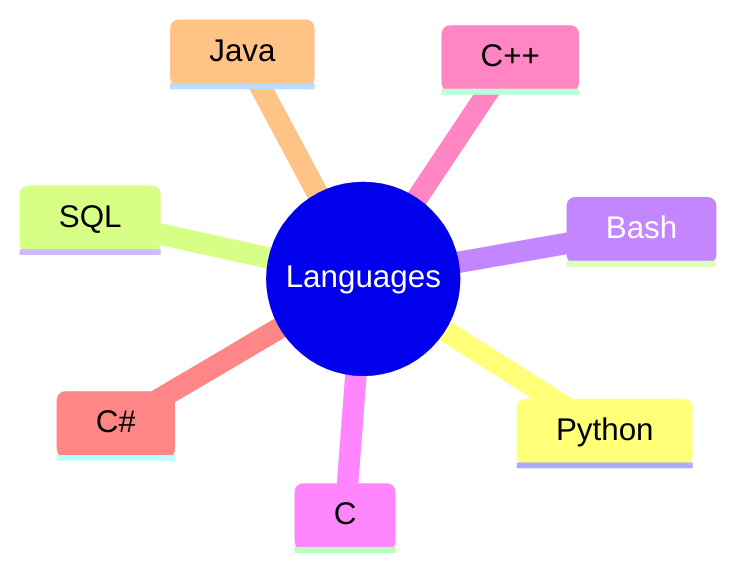

# Hi, I'm Timofey Shalnev

### System programming engineer | [NSU](https://english.nsu.ru/) Student
  
I'm high course student of CS having experience working in the industry

### Engineering experience
- Working with [PostgresPro](https://github.com/postgrespro) on a project of fault-tolerance [DB extension](https://github.com/extio1/pg_leader) and [isolating bg worker processes in own cgroup](https://github.com/extio1/pg_isolate)
- Working with [Sber](https://sbertech.ru/) on virtual machine project (NDA)

