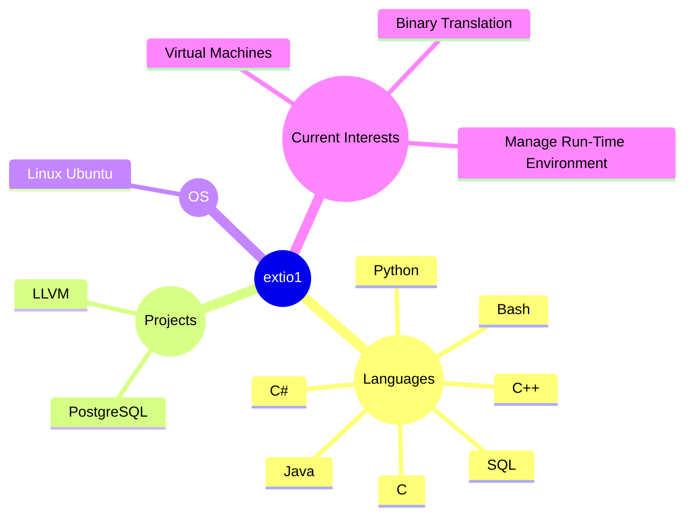

# Hi, I'm Timofey Shalnev

### System software engineer
  
I'm high course student of MSCS with the expertice in the industry of developing compiler and virtual machines.

```mermaid
mindmap
  root((extio1))
    ((Languages))
      Python
      SQL
      Bash
      C
      C++
      C#
      Java
    ((Projects))
      PostgreSQL
      LLVM
    ((OS))
      Linux Ubuntu
    ((Current Interests))
      Virtual Machines
      Binary Translation
      Manage Run-Time Environment
```
